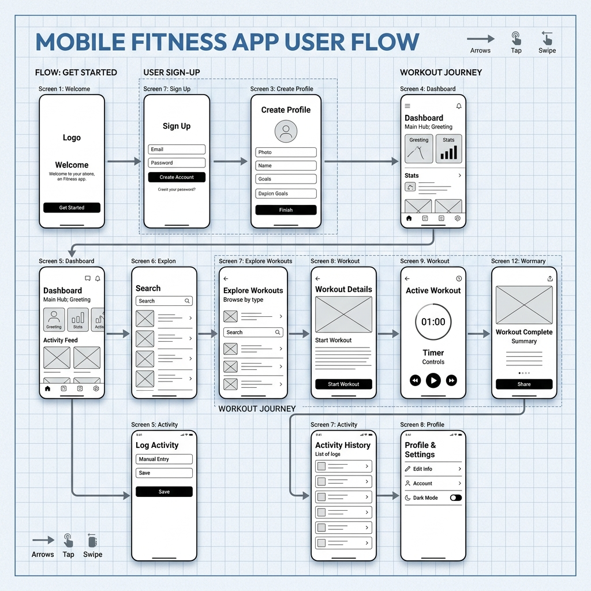
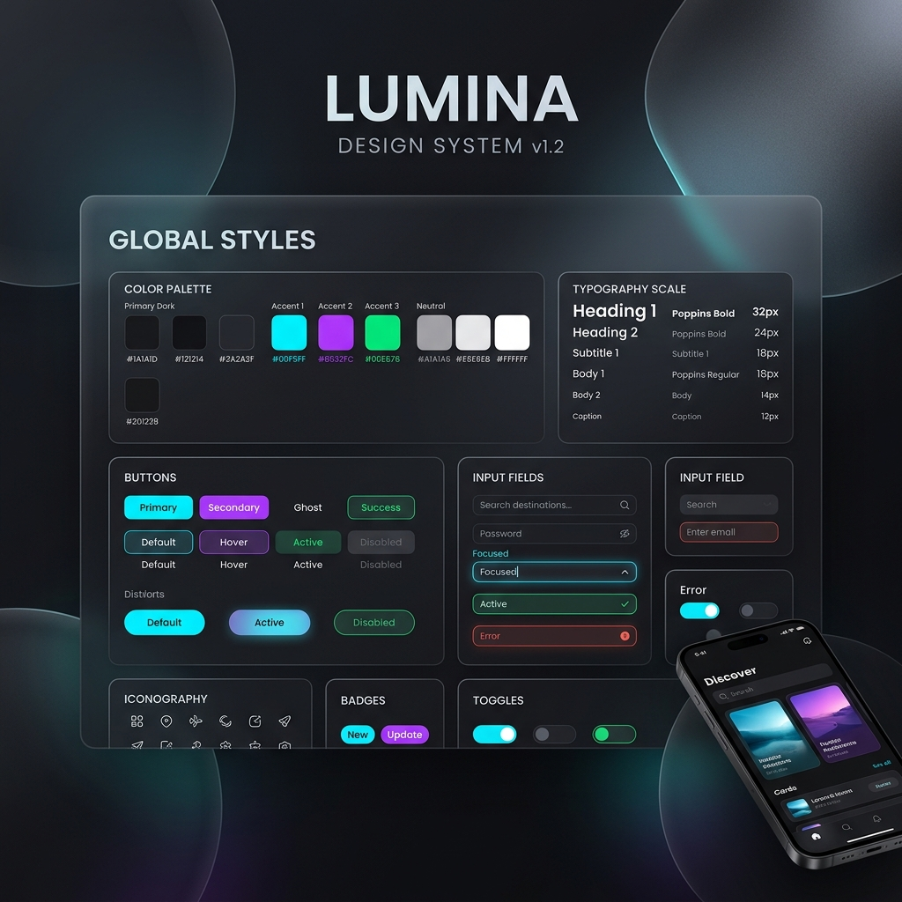

# Epilogue: A Modern Reading Experience
## Reimagining how we discover and track literature

Epilogue is a comprehensive mobile solution designed to elevate the digital reading journey. This completed case study explores the development of an intuitive platform that bridges the gap between cataloging books and social discovery. The goal was to build a product that maintains high user engagement through streamlined workflows and modern aesthetics without overwhelming the reader.

## Final UI Design

Here are the final designs of the application, featuring a dark mode aesthetic, vibrant colors, and glassmorphism elements.

  
  

## Wireframing & User Flows

Before diving into high-fidelity designs, extensive user research grounded every design decision. I mapped out critical pain points and translated them into clear wireframes and logical user flows. This ensured the foundation of the app was built on usability and intuitive navigation rather than just aesthetics.

  

## Design System & Component Library

To maintain consistency and scalability across the platform, I built a comprehensive design system. This included typography scales, a carefully curated dark-mode color palette with vibrant accents, and reusable UI components like buttons, input fields, and iconography.

  

## Development & Feasibility

The design process utilized industry-standard tools including Figma, FigJam, Notion, and Miro. Beyond pure design, a heavy focus was placed on **frontend feasibility**. I collaborated closely with engineering principles in mind, structuring layouts and components so they could be easily translated into a **React** environment.

The project follows the Double Diamond design methodology: Discover, Define, Develop, and Deliver, resulting in a premium, cohesive experience for bibliophiles everywhere.

