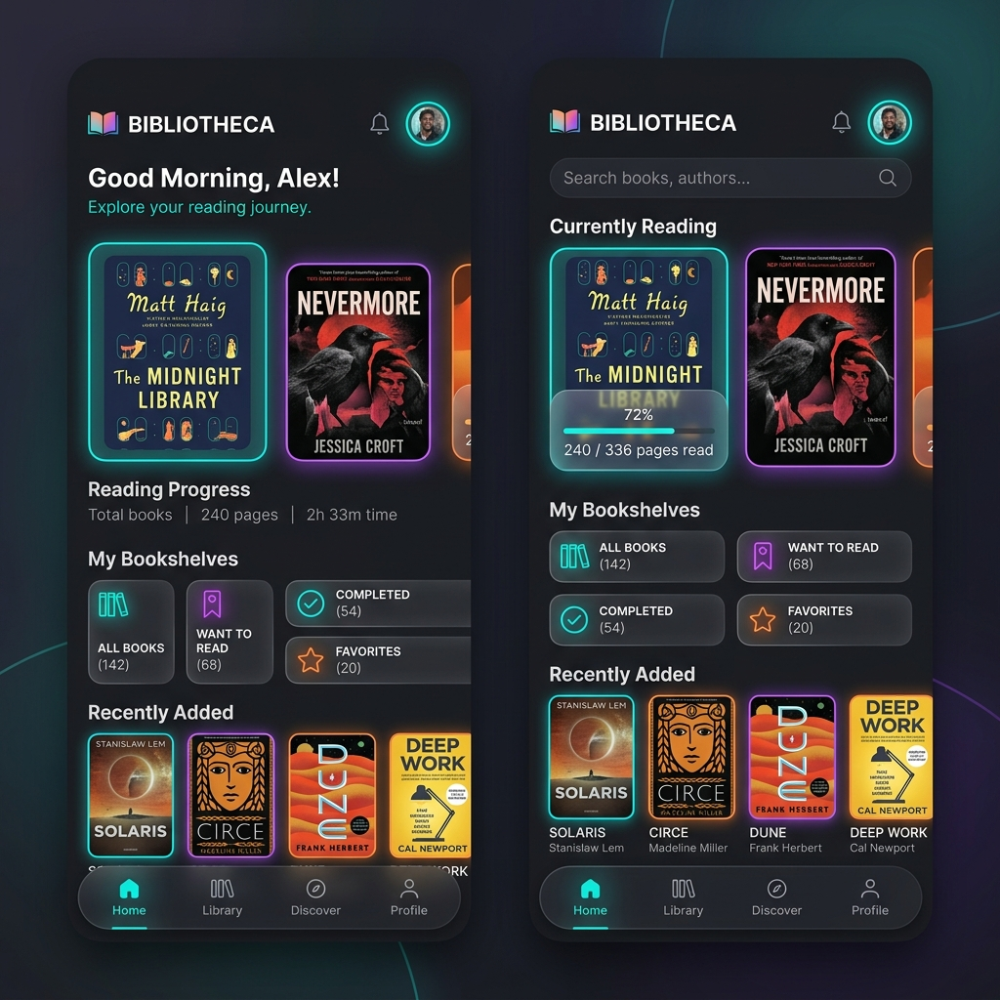
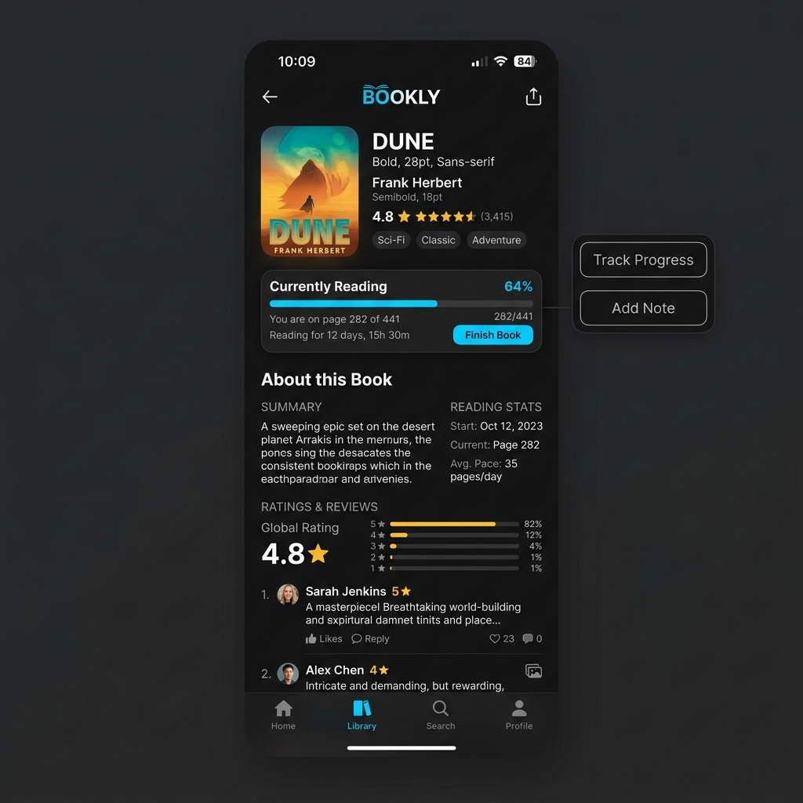

# Epilogue: A Modern Reading Experience
## Reimagining how we discover and track literature

Epilogue is a comprehensive mobile solution designed to elevate the digital reading journey. This completed case study explores the development of an intuitive platform that bridges the gap between cataloging books and social discovery. The goal was to build a product that maintains high user engagement through streamlined workflows and modern aesthetics without overwhelming the reader.

## Final UI Design

Here are the final designs of the application, featuring a dark mode aesthetic, vibrant colors, and glassmorphism elements.

  
  

The design process utilized industry-standard tools including Figma, FigJam, Notion, Miro, and React, with a heavy focus on advanced prototyping through Figma Smart Animate.

My strategy focused on identifying and solving core friction points in the modern reading app landscape. Key innovations include optimized navigation frameworks, enhanced content discovery algorithms, and a refined visual hierarchy that prioritizes readability and user focus. These enhancements aim to provide a premium, cohesive experience for bibliophiles everywhere.

Extensive user research grounded every design decision. By analyzing qualitative data, I mapped out critical pain points and unmet needs in existing book-tracking solutions. These insights directly informed the feature roadmap, ensuring that Epilogue's development was driven by real-world user behaviors and expectations.

The project follows the Double Diamond design methodology: Discover, Define, Develop, and Deliver.

